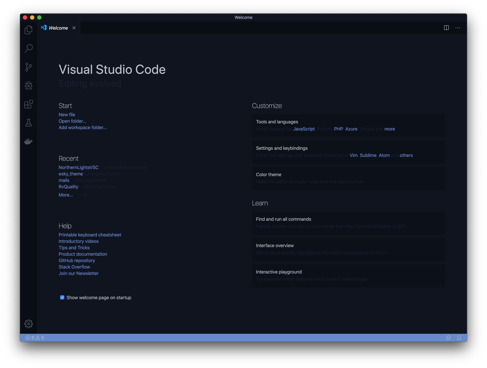
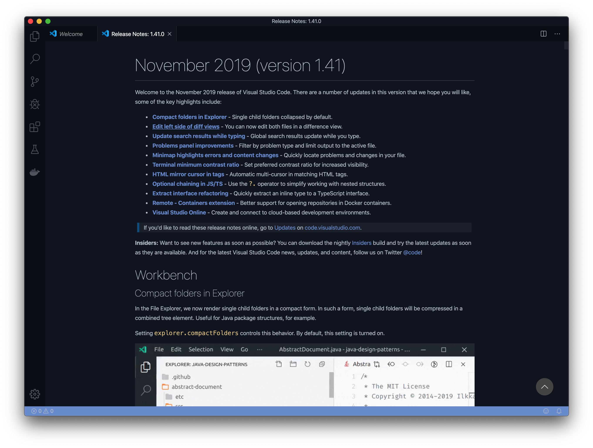
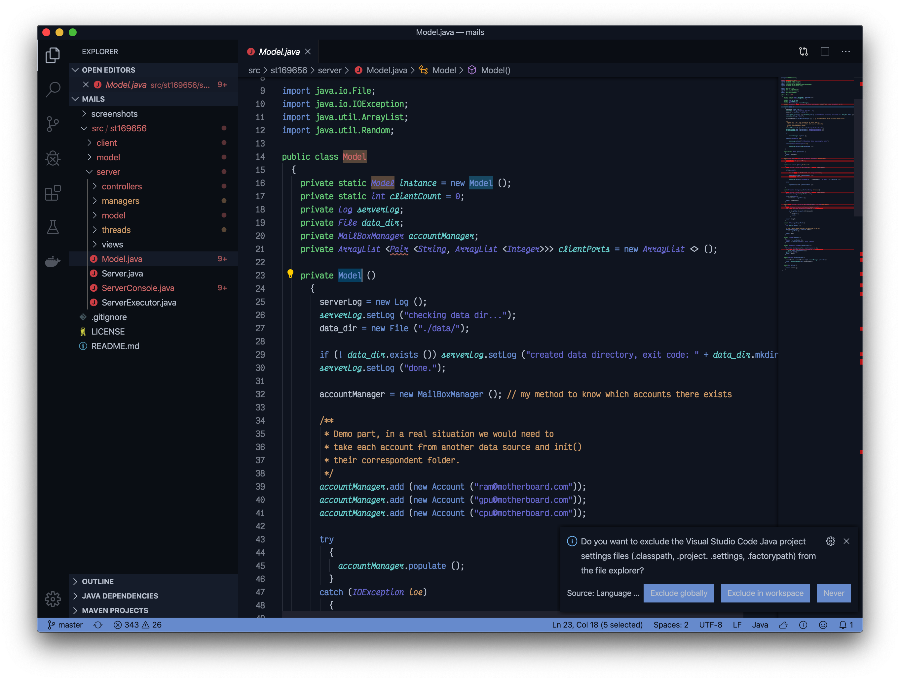

# NorthernLights: A dark blue Visual Studio Code theme
Based on the bright colors of the Northern Lights, this eye-pleasing theme will enhance your coding experience.

* Reduce eye strain with the dark background
* Relaxing blue tint
* Immediately recognize what's important with the rightful colors

## Screenshots
Welcome and Release notes Screens




Main Editor & Notifications



## Installation
You can install this theme through [VSCode Marketplace](https://marketplace.visualstudio.com/items?itemName=Eskilop.northernlights), [Open-VSX](https://open-vsx.org/extension/Eskilop/northernlights) or:

### Cloning
* Linux/MacOS
```bash
git clone https://github.com/eskilop/NorthernLightsVSC.git ~/.vscode/extensions/northernlights
```
* Windows
```bash
git clone https://github.com/eskilop/NorthernLightsVSC.git %USERPROFILE%\.vscode\extensions\northernlights
```

To see it listed in your themes, reload your current vscode window (open command palette > reload window)

### From File
Go to the [releases page](https://github.com/NorthernLightsTheme/NorthernLightsVSC/releases), download the latest .vsix file, then in Visual Studio Code, in the Extensions panel, look up, the horizontal three-dots menu, click it and then click "Install from VSIX", choose the file you downloaded and click "Install".
